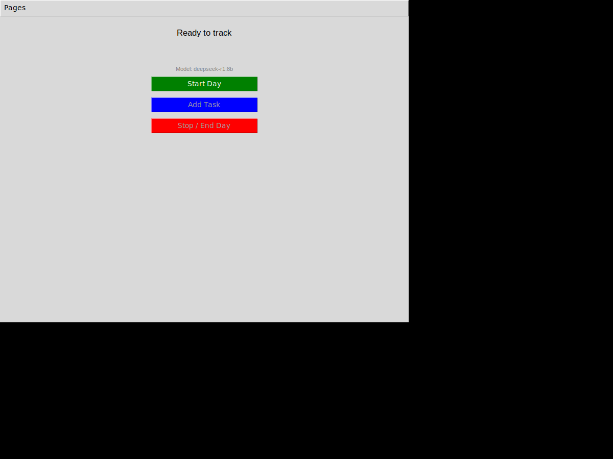
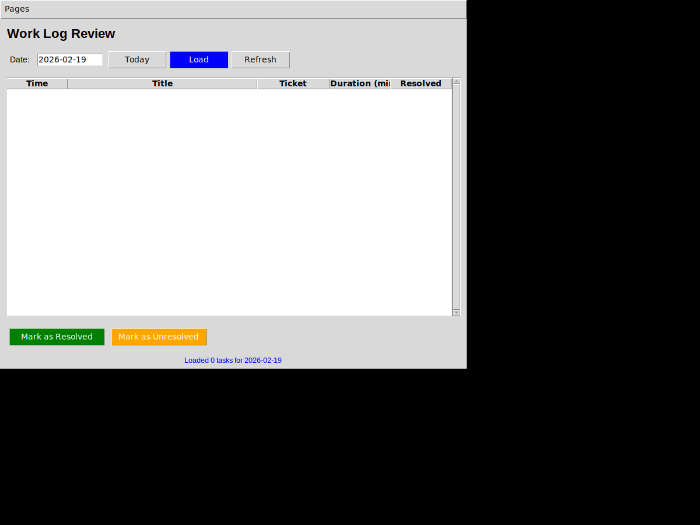

# SheepCat — Look & Feel Description

This document describes the visual design and user-experience feel of the SheepCat task-tracking application, generated from live screenshots of the running app.

---

## Screenshots

### Task Tracker Page

### Work Log Review Page

---

## Overall Aesthetic

SheepCat uses a **native desktop look** built with Python's built-in `tkinter` toolkit. This means the interface inherits the operating system's default widget styling — on Linux this produces the classic grey-windowed Motif/Tk appearance, while on Windows and macOS it will adopt those platforms' native look. The result is a deliberately simple, distraction-free aesthetic that feels familiar and approachable, with no custom theming or flashy graphics.

The application opens as a **800 × 600 pixel window** titled *"M Work - Task tracker"*. The window is resizable and the content fills its area, but the design is intentionally minimal to avoid overwhelming the user.

---

## Menu Bar

At the very top of the window sits a **thin, native menu bar** containing a single top-level item:

- **Pages** — a dropdown that lets you switch between the two pages of the app:
  - *Task Tracker* (the main tracking screen)
  - *Review Work Log* (the history/edit screen)
  - *Exit* (closes the application)

The menu bar is the primary (and only) navigation mechanism. It stays visible no matter which page is active, giving the user a consistent anchor point.

---

## Page 1: Task Tracker

The Task Tracker is the **default landing page** — the first thing you see when you open the app.

### Layout & Visual Style

The page has a **plain light-grey background** with all content centred horizontally. There is plenty of intentional whitespace, which keeps the interface calm and uncluttered — in keeping with the app's neurodivergent-friendly philosophy.

### Elements (top to bottom)

1. **Status label** — centred, Arial 12 pt text.
   - At startup it reads *"Ready to track"*.
   - While a session is running it updates to describe the current state (e.g. *"Tracking: 2 task(s) this hour"*).

2. **Countdown label** — centred, Arial 10 pt **bold**, rendered in **blue**.
   - Hidden when no session is active.
   - During a session it counts down to the next hourly check-in: e.g. *"Next check-in in: 00:45:32"*.

3. **Model indicator** — small Arial 8 pt text in **grey**, just below the countdown.
   - Shows the LLM model currently configured, e.g. *"Model: deepseek-r1:8b"*.
   - Subtle and unobtrusive — useful for power users, invisible to casual users.

4. **Three large action buttons** — each is roughly 20 characters wide and stacked vertically with consistent spacing. They use a **traffic-light colour scheme**:

   | Button | Colour | State at startup |
   |---|---|---|
   | **Start Day** | 🟢 Green background, white text | Enabled |
   | **Add Task** | 🔵 Blue background, white text | Disabled (greyed-out) |
   | **Stop / End Day** | 🔴 Red background, white text | Disabled (greyed-out) |

   Once *Start Day* is clicked, the Start button disables and the other two activate. This simple enable/disable pattern provides a clear, guided flow and prevents accidental actions.

### Feel

The Task Tracker page feels **calm and focused**. The large, clearly-coloured buttons make the three key actions immediately obvious even at a glance. The countdown timer gives a gentle sense of pace without being intrusive.

---

## Page 2: Work Log Review

The Review page is reached via *Pages → Review Work Log* in the menu bar.

### Layout & Visual Style

Like the tracker page, the background is **light grey**. The content is laid out in a top-to-bottom structure with three distinct zones: a header/filter bar, a large data table, and an action bar at the bottom.

### Elements (top to bottom)

1. **Page title** — *"Work Log Review"* in **Arial 16 pt bold**, left-aligned at the top. Gives clear context about which page you are on.

2. **Date selector bar** — a horizontal row containing:
   - *"Date:"* label
   - A **date input field** (editable text box, pre-filled with today's date in `YYYY-MM-DD` format)
   - **Today** button — grey, resets the date field to today and reloads
   - **Load** button — **blue**, loads tasks for the date currently in the field
   - **Refresh** button — grey, reloads the current date

   The blue Load button stands out as the primary action in this bar.

3. **Task table (Treeview)** — a scrollable table that fills most of the page. It has five columns:

   | Column | Description |
   |---|---|
   | **Time** | The time the task was logged (HH:MM) |
   | **Title** | Short description of the task |
   | **Ticket** | Ticket ID or reference (e.g. JIRA/GitHub number) |
   | **Duration (min)** | How long was spent on the task |
   | **Resolved** | Yes or No |

   - A **vertical scrollbar** sits on the right edge of the table for navigating long lists.
   - When no data exists for the selected date, the table body appears as a plain **white rectangle** — empty but clean.
   - Column headers are displayed in **bold** with a subtle border, matching the standard `ttk.Treeview` style.

4. **Action buttons** — two buttons sit below the table, left-aligned:
   - **Mark as Resolved** — 🟢 green background, white text
   - **Mark as Unresolved** — 🟠 orange background, white text

   These buttons operate on whichever rows are selected in the table. Multiple rows can be selected using standard Ctrl+Click (or Cmd+Click on Mac).

5. **Status label** — small **blue** text at the very bottom, reporting the outcome of the last operation, e.g. *"Loaded 0 tasks for 2026-02-19"* or *"Marked 2 task(s) as resolved"*.

### Feel

The Review page feels like a **lightweight spreadsheet or log viewer**. It is functional and informative without being overwhelming. The date picker makes it easy to jump to any past day, and the action buttons make updating resolved status effortless — either via the buttons or by double-clicking a row to toggle it instantly.

---

## Colour Palette Summary

| Element | Colour |
|---|---|
| Window / page background | Light grey (`#d9d9d9` default Tk) |
| Start Day button | Green (`#008000`) |
| Add Task button | Blue (`#0000ff`) |
| Stop / End Day button | Red (`#ff0000`) |
| Load button | Blue (`#0000ff`) |
| Mark as Resolved button | Green (`#008000`) |
| Mark as Unresolved button | Orange (`#ffa500`) |
| Countdown / status text | Blue |
| Model indicator text | Grey |
| Table header text | Bold black |
| Table body background | White |

---

## Typography

All text uses **Arial** at various sizes:
- **16 pt bold** — page titles
- **12 pt** — main status text
- **10 pt bold** — countdown timer
- **10 pt** — body labels, buttons, table content
- **9 pt** — footer status labels
- **8 pt grey** — subtle informational text (model name)

---

## Interaction Patterns

- **Button enable/disable** — guides the user through a linear workflow (Start → Add Tasks → Stop)
- **Double-click to toggle** — on the Review page, double-clicking a task row instantly toggles its resolved status
- **Multi-select** — standard OS-native selection (Ctrl/Cmd+Click) works in the table for bulk operations
- **Background threading** — AI summary generation runs in a background thread so the UI never freezes
- **Modal dialogs** — task entry and the end-of-day summary editor appear as pop-up dialogs that lock focus until dismissed

---

## Summary

SheepCat's interface is deliberately **simple, functional, and non-distracting**. The use of familiar native widgets, a small window size, and a clear traffic-light button scheme means users can understand the entire application at a glance. There are no animations, no sidebars, no dashboards — just the essential controls to start a day, log tasks, and review your history. This restraint is intentional: the goal is to reduce cognitive load and make task tracking feel effortless rather than burdensome.
